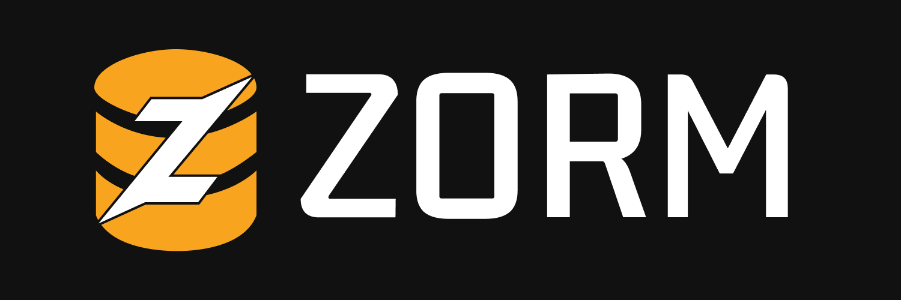

# ZORM



> **Note:** ZORM is a work in progress (WIP).
>
> **For schema syntax highlighting and LSP support, check out the [ZORM VSCode Extension](https://marketplace.visualstudio.com/items?itemName=TonyArtZ.zorm) and [the Github repo](https://github.com/Tony-ArtZ/zorm-lsp).**

ZORM is a Zig ORM library with a custom schema file support. You can define your schema in a readable .zorm file and let the zorm-generator generate the necessary typings for you.

Currently ZORM only supports `Postgres` and `Sqlite3`. More functionality and backends are being worked on.

## Features

- Static library for embedding in Zig projects
- Generator tool to convert `.zorm` schema files to Zig code
- Supports both SQLite and PostgreSQL backends
- Easily extensible and integrates with Zig build system

## Getting Started

### 1. Add as Dependency

Add ZORM to your `build.zig.zon`:

```zig
.{
  .dependencies = .{
    .zorm = .{
      .url = "https://github.com/Tony-ArtZ/zorm/archive/refs/heads/main.tar.gz",
    },
  },
}
```

### 2. Add ZORM to your build.zig

```zig
const zorm_dep = b.dependency("zorm", .{
    .target = target,
    .optimize = optimize,
});
const zorm_mod = zorm_dep.module("zorm");

const exe = b.addExecutable(.{
    .name = "zorm_test",
    .root_module = exe_mod,
});

exe.root_module.addImport("zorm", zorm_mod);
```

### 3. Generating the schema

You have two options to generate Zig code from your `.zorm` schema:

#### Option 1: Build and run the generator executable

1. Clone the zorm repository and build the generator:

```sh
git clone https://github.com/Tony-ArtZ/zorm.git
cd zorm
zig build generator
```

2. Run the generator with your schema and output paths:

```sh
./zig-out/bin/zorm-generator <input_schema_path> <output_path>
```

#### Option 2: Use the generator programmatically in Zig

Import and call the generator in your Zig code:

```zig
const zorm = @import("zorm");
try zorm.generator.generateSchema(
    allocator,         // std.mem.Allocator
    schema_path,       // []const u8
    output_path        // []const u8
);
```

## Schema Definition (`schema.zorm`)

Define your data models and backend in a `.zorm` file. For example:

```zorm
[config]
backend postgres

model User {
  id     Int     @id
  name   String
  email  String  @unique
  age    Int?
}
```

- The `[config]` section specifies the backend (`postgres` or `sqlite`).
- Each `model` defines a table with fields and attributes (e.g., `@id`, `@unique`).
- Optional fields use `?` (e.g., `Int?`).

See `examples/schema.zorm` for a complete example.

## Example Usage

See the [`examples/`](examples/) directory for a full working example. Here is a minimal usage:

```zig
const std = @import("std");
const zorm = @import("zorm");
const schema = @import("generated_schema.zig"); // Generated from schema.zorm
const SQLITE = zorm.SQLITE;

pub fn main() !void {
    var gpa = std.heap.GeneralPurposeAllocator(.{}){};
    defer _ = gpa.deinit();
    const allocator = gpa.allocator();

    // Initialize SQLite backend
    var db = SQLITE.init(allocator);
    defer db.disconnect();

    try db.connect("test.db");
    try db.createTable(schema.UserMeta);

    const user = schema.User{
        .id = "1",
        .name = "John Doe",
        .email = "john@example.com",
        .age = "30",
    };
    try db.insert(schema.User, user);
    std.debug.print("User inserted successfully!\n", .{});
}
```

- The example above uses SQLite, but you can switch to PostgreSQL by changing the backend and connection string.
- The generated schema file provides types and metadata for your models.
- You can switch to PostgreSQL by using `const PG = zorm.pg.PG;` and updating the backend initialization and connection string.
- The generated schema file will provide types like `User` and `UserMeta`.

## More Examples

- See [`examples/example.zig`](examples/example.zig) for a complete example.
- See [`examples/schema.zorm`](examples/schema.zorm) for a sample schema definition.

## Roadmap & Status

- ZORM is a **work in progress**. Features and APIs may change.
- Contributions and feedback are welcome!

## License

MIT
